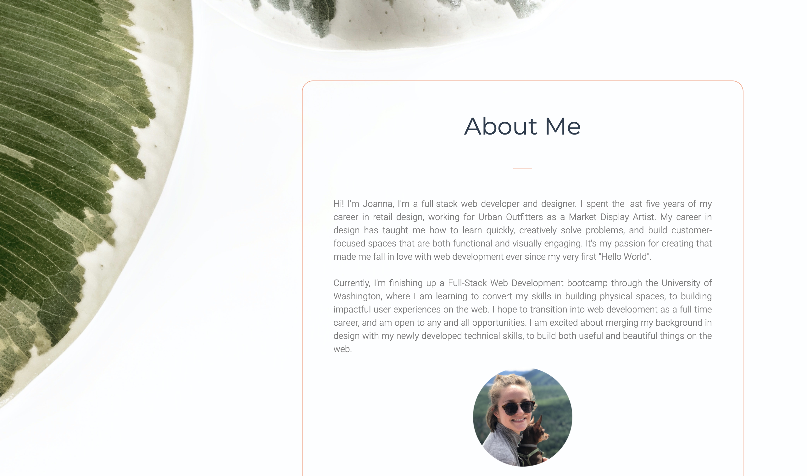
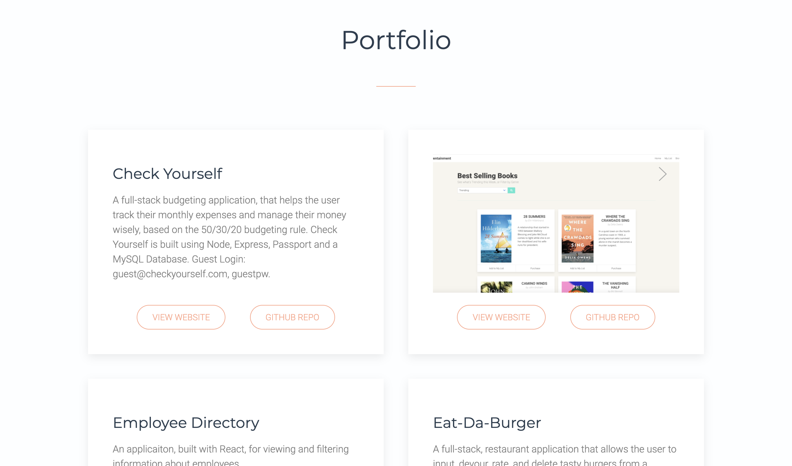
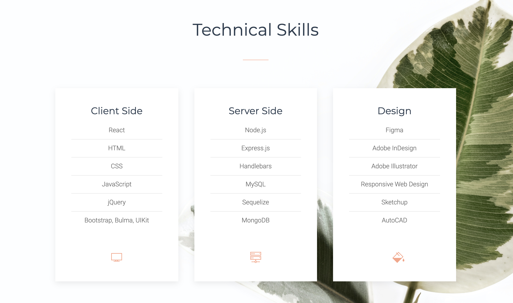

# [React Portfolio](http://jpreston-alt.github.io/react-portfolio)

## Description
Hi! Thanks for checking out my portfolio. I am currently finishing up a Certificate from The University of Washington's Full-Stack Web Development Bootcamp and am hoping to transition into web development as a career. As I begin the job search, I needed a place to be able to send potential employers to view examples of my work, and find out more about me. I built this site using React, which might be my favorite technology I've learned throughout the bootcamp. I find breaking up code into reuseable components not only fun, but extremely useful in saving time and developing an overall style.

From the [deployed site](http://jpreston-alt.github.io/react-portfolio), one can read about me, view my resume, technical skills, and links to my LinkedIn and GitHub. In the Portfolio section one can find descriptions of my recent projects, as well as links to their GitHub repositories and deployed sites. In order to view project screenshots click on the arrow in the right hand corner of the project card.

Thanks for checking it out!

 

 

## Technologies
* React
* HTML
* CSS
* [UIKit](https://getuikit.com/)
* JavaScript
* [Animate.css](https://animate.style/)

## Finished Product
View deployed site [here](http://jpreston-alt.github.io/react-portfolio).  

## Credits
* Background photo by [Scott Webb](https://www.pexels.com/@scottwebb) from Pexels.
* [OSTraining](https://www.youtube.com/watch?v=DXXh_dUHq3c) on YouTube for their tutorial on responsive menus with UIKit.

## Contact Me
On GitHub: [jpreston-alt](https://github.com/jpreston-alt) | Via Email: joannappreston@gmail.com